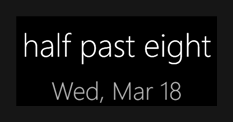
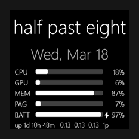
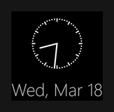
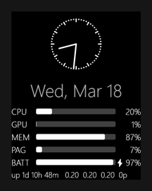

# Fuzzy Clock

A minimal WPF desktop widget that displays the current time as a fuzzy English phrase — *"just a little after 11"*, *"almost noon"*, *"quarter past 3"* — or as a minimal analog dial with hour and minute hands. It floats on the desktop as a transparent, frameless, always-on-top overlay with no background box.

## Screenshots

| Phrase mode | Phrase + stats |
|:-----------:|:--------------:|
|  |  |
| **Dial mode** | **Dial + stats** |
|  |  |

## Features

- **Phrase mode** — time expressed as natural English, updating on 5-minute boundaries
- **Dial mode** — hour and minute hands on a transparent background (no face, no numbers); optional hour ticks, minute marks, and hour labels
- **Stats panel** — live CPU / GPU / MEM / PAG usage as horizontal bars below the phrase or dial; per-row visibility toggles; 1s / 3s / 10s update interval
- **Battery row** — shows battery charge percentage and `⚡` when AC-connected (e.g. `⚡ 87%`); displays `N/A` on desktops or VMs with no battery; toggleable per-row like other stat rows
- **Uptime row** — system uptime (`up 5h 3m`), rolling 1m/5m/15m CPU load averages, and active process count (`142p`) in a single compact line
- **Date display** — shows the current date below the clock phrase or dial in a muted accent color; toggleable; four format options:
  - Short: `Sat, Mar 7`
  - Long: `Saturday, March 7`
  - Numeric: `3/7/2026`
  - ISO: `2026-03-07`
- **Ghost mode** — hovering the mouse over the widget automatically hides it (fully transparent and click-through) so it never blocks the desktop; moving the mouse away restores it; customize which modifier keys (Ctrl/Alt/Shift) suppress ghost fade via Settings > Behavior; defaults to Ctrl+Alt; toggleable via tray
- **Auto-contrast** — samples the screen color under the widget every 500ms and automatically switches text to black or white (WCAG-based) when the accent color loses contrast against the background; toggleable via tray
- **Accent colors** — five quick presets (White, Amber, Ice Blue, Green, Hello Kitty Pink) via Settings, or pick any custom color; applies to all text, hands, bars, and decorations
- **Window opacity** — 25% / 50% / 75% / 100% via Settings or scroll wheel in 10% steps
- **Font size** — Small (16pt) / Medium (24pt) / Large (32pt) / Extra Large (40pt) via Settings (phrase mode only)
- **Hover backdrop** — semi-transparent dark background covers the full widget footprint (phrase, date, stats) on hover; optional always-visible mode and configurable opacity (10%–100%) via Settings Appearance tab
- **Hover fast-refresh** — stats accelerate to 0.5s while the mouse is over the widget (hold configured modifier keys to hover without triggering ghost mode; defaults to Ctrl+Alt)
- **Auto-launch** — optionally start the widget at Windows login; toggled via the system tray
- **Per-monitor position memory** — position is remembered per-monitor; switching monitors restores the last-used position on each display
- **Drag anywhere** — left-click drag repositions freely; position saved immediately
- **Persistence** — all preferences saved to `%LOCALAPPDATA%\FuzzyClock\settings.json`
- **Settings window** — open from the system tray ("Open Settings..."); three tabs organize all preferences:
  - *Appearance* — named themes, accent color, opacity, font size, clock style, phrase style, phrase wrap
  - *Stats* — stats panel visibility, individual row toggles, update interval, process threshold, date display
  - *Behavior* — phrase language, ghost mode, ghost override modifiers (Ctrl/Alt/Shift), auto-contrast, auto-launch, battery alert threshold
- **Named themes** — five one-click theme presets in the Settings Appearance tab: Midnight, Neon, Ghost, Warm, Terminal; each sets a coordinated accent color, opacity, font size, clock style, and stats visibility
- **Phrase styles** — four English phrase personalities: Classic (default natural), Terse (compact), Poetic (literary), Rude (irreverent); selectable in Settings Appearance tab (English locales only)
- **Multilingual phrases** — time phrases available in English, French, Spanish, German, Japanese, and Polish; auto-detects from Windows display language or override in Settings Behavior tab
- **Phrase wrapping** — when a phrase is more than 10% wider than the stats panel, it automatically splits across two lines; two split styles: Nearest Midpoint (word break closest to string center, default) and Natural Pause (split after first grammatical beat, English only); configurable in Settings Appearance tab
- **Edge snapping** — dragging the widget to within 8 pixels of any screen edge snaps it flush to that edge; respects the taskbar working area
- **Single instance** — launching the app when it is already running brings the existing window to the front instead of opening a second instance
- **Battery low alert** — battery stat row background turns red when charge drops below a configurable threshold (10%/15%/20%) and the device is unplugged; configurable in Settings Behavior tab
- **Dark-mode Settings** — the Settings window uses a dark background with light text matching the widget's minimal aesthetic
- **Update notice** — when a newer FuzzyClock release is published on GitHub, a one-line accent-colored "vX.Y.Z available" notice appears at the bottom of the stats panel; checked once per launch. The check can be disabled in Settings > Behavior > "Check for updates on launch" (default ON).

## Requirements

- Windows 10 or 11
- [.NET 10 Desktop Runtime](https://dotnet.microsoft.com/download/dotnet/10.0) (or SDK for building from source)

## Installation

Download `FuzzyClockSetup-X.Y.Z.exe` from the latest [GitHub Release](../../releases/latest) and run it. The installer places the app in `%LOCALAPPDATA%\Programs\FuzzyClock\` with no admin elevation required.

A standalone portable `FuzzyClock-X.Y.Z.exe` is also available from the same release page.

> **SmartScreen warning:** The binary is not code-signed. Windows SmartScreen may show a warning on first run. Click **More info** then **Run anyway** to proceed.

Upgrading: run the new installer over the existing installation. Settings are preserved. If the app is running, the installer will prompt you to close it first.

Uninstalling: use **Settings > Apps > Installed Apps** or the Start Menu uninstaller. App files are removed; `settings.json` is preserved by default (an optional checkbox during uninstall lets you remove it).

## Build

```bash
dotnet build FuzzyClock.slnx
```

## Run

```bash
dotnet run --project FuzzyClock.App
```

Or build and launch the executable directly:

```bash
dotnet build FuzzyClock.slnx -c Release
./FuzzyClock.App/bin/Release/net10.0-windows/FuzzyClock.exe
```

## Test

```bash
dotnet test FuzzyClock.slnx
```

274 unit tests: phrase engine (all 5-minute buckets, noon/midnight, edge cases), dial geometry, uptime formatter, date formatter (all 4 formats), phrase wrap service, settings validation and migration, and app integration tests.

## Usage

### Right-click context menu

Right-click the system tray icon to access all settings:

| Item | Description |
|------|-------------|
| **Open Settings...** | Open the Settings window (Appearance / Stats / Behavior tabs) |
| **Ghost Mode** | Enable/disable hover-to-hide (checkmark = active) |
| **Show Stats** | Show/hide the stats panel (checkmark = active) |
| **Auto-Contrast** | Enable/disable automatic text contrast adjustment (checkmark = active) |
| **Auto-Launch at Login** | Enable/disable start at Windows login (checkmark = active) |
| **Reset to Defaults** | Restore factory settings (accent, opacity, font size, phrase style, locale, all toggles) |
| **About** | Show version information |
| **Quit** | Exit the application |

### Mouse interactions

| Action | Effect |
|--------|--------|
| **Left-click drag** | Move the widget |
| **Scroll wheel** | Adjust opacity in 10% steps |
| **Hover** | Ghost mode: widget fades out and becomes click-through |
| **Modifier keys + hover** | Suppress ghost mode; activates hover backdrop and fast stats refresh instead (configurable via Settings > Behavior; defaults to Ctrl+Alt) |

### System tray

The tray icon is the primary UI surface. Right-click it to access quick toggles (Ghost Mode, Show Stats, Auto-Contrast, Auto-Launch) and open the full Settings window. All detailed configuration (themes, phrase style, language, stats rows, date format, battery alert, phrase wrap) lives in the Settings window.

### Settings Window

Open from the tray menu ("Open Settings..."). The window has three tabs:

**Appearance** — Named theme presets (Midnight / Neon / Ghost / Warm / Terminal), accent color swatches and custom picker, opacity slider, font size, clock style (Phrase / Dial), phrase style (Classic / Terse / Poetic / Rude), phrase wrap controls (enable/disable, split style), and backdrop controls (always-visible toggle, opacity slider).

**Stats** — Stats panel toggle, individual row visibility (CPU / GPU / Memory / Paging / Battery / Uptime), update interval, process count threshold, date visibility, and date format.

**Behavior** — Phrase language (Auto / English / French / Spanish / German / Japanese / Polish), ghost mode, ghost override modifiers (customize which modifier keys suppress ghost fade: Left Ctrl / Left Alt / Left Shift), auto-contrast, auto-launch at login, check for updates on launch, and battery alert threshold (10% / 15% / 20%).

## Project Structure

```
FuzzyClock.slnx
├── FuzzyClock.Core/          # Pure logic (PhraseEngine, DialGeometry, UptimeFormatter, DateFormatter, PhraseWrapService, ContrastService)
├── FuzzyClock.Core.Tests/    # MSTest unit tests for Core logic
├── FuzzyClock.App/           # WPF overlay window
│   ├── MainWindow.xaml(.cs)  # Main UI and event handlers
│   ├── SettingsWindow.xaml(.cs)     # Three-tab settings UI (Appearance / Stats / Behavior)
│   ├── StatsService.cs       # PDH performance counters (CPU/GPU/MEM/PAG)
│   ├── ContrastSamplerService.cs  # BitBlt screen color sampling
│   ├── GhostModeController.cs     # Win32 click-through and restore timer
│   ├── TrayMenuBuilder.cs         # System tray icon and menu construction
│   ├── ContrastRefreshController.cs # 500ms auto-contrast timer
│   ├── AutoLaunchService.cs       # Registry auto-launch management
│   ├── MonitorService.cs          # Per-monitor identity and position tracking
│   └── SettingsService.cs         # JSON settings I/O and migration
└── FuzzyClock.App.Tests/     # MSTest integration tests for App layer
```

`FuzzyClock.Core` has no external dependencies. `FuzzyClock.App` references `System.Diagnostics.PerformanceCounter` (NuGet) for PDH stats counters.

## Settings File

Preferences are stored at `%LOCALAPPDATA%\FuzzyClock\settings.json` and written atomically (temp file + rename). Safe to delete to reset all preferences to defaults.

## Planning Docs

| File | Description |
|------|-------------|
| [.planning/PROJECT.md](.planning/PROJECT.md) | Full feature list, key decisions, and architecture notes |
| [.planning/ROADMAP.md](.planning/ROADMAP.md) | Phase-by-phase build roadmap |
| [.planning/MILESTONES.md](.planning/MILESTONES.md) | Shipped milestone history and accomplishments |
| [.planning/STATE.md](.planning/STATE.md) | Current project state and next action |
